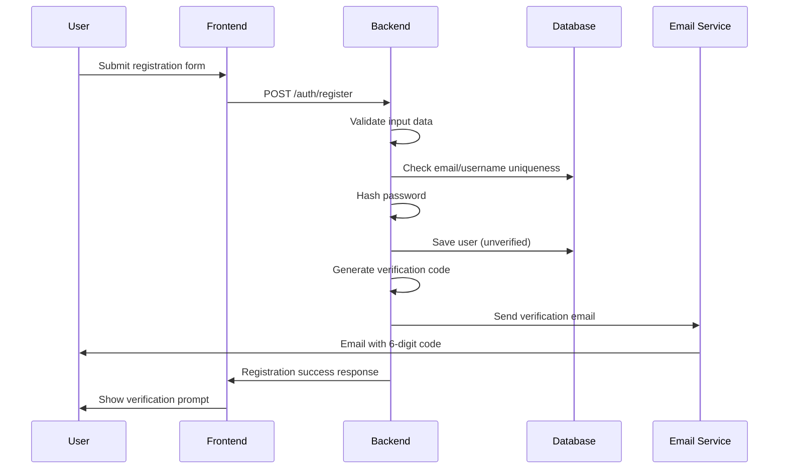
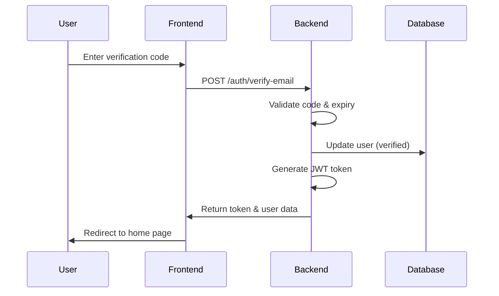
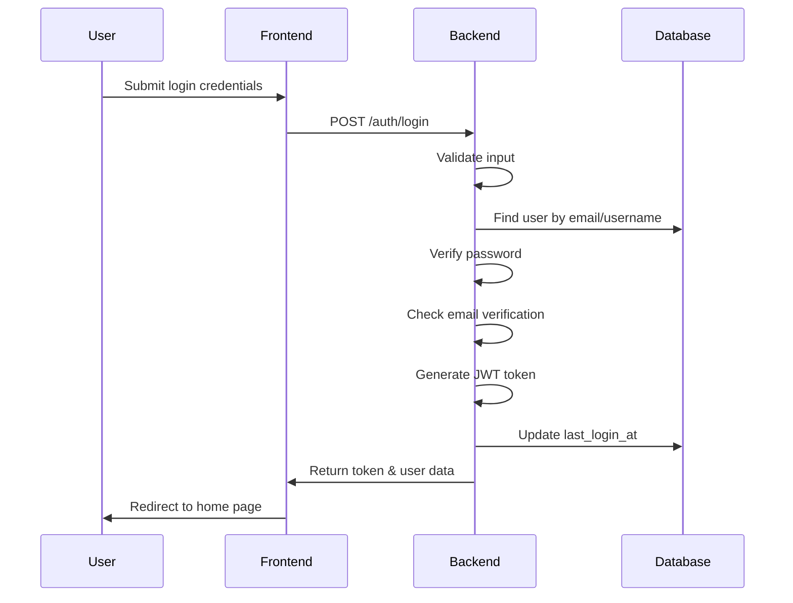
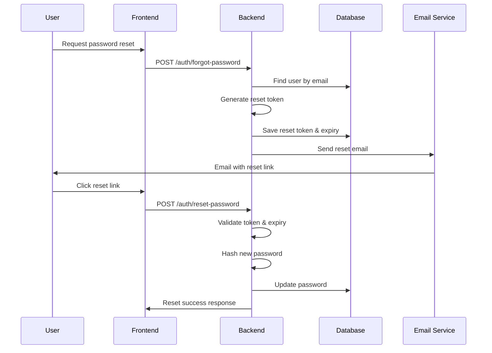

# UpVista Community - Authentication System Architecture

## Overview

This document outlines the complete authentication system architecture for UpVista Community, covering user registration, login, email verification, password management, and session handling.

---

## 📋 Table of Contents

1. [System Requirements](#system-requirements)
2. [Architecture Overview](#architecture-overview)
3. [Database Schema](#database-schema)
4. [API Endpoints](#api-endpoints)
5. [Authentication Flow](#authentication-flow)
6. [Security Features](#security-features)
7. [Implementation Structure](#implementation-structure)
8. [Configuration](#configuration)
9. [Testing Strategy](#testing-strategy)
10. [Deployment Considerations](#deployment-considerations)

---

## 🎯 System Requirements

### Core Features
- **User Registration**: Email/password with validation
- **Email Verification**: 6-digit code via SMTP
- **User Login**: Email or username authentication
- **Password Management**: Secure hashing, reset flow
- **Session Management**: JWT tokens with refresh mechanism
- **Input Validation**: Comprehensive data validation
- **Rate Limiting**: Protection against brute force attacks

### User Registration Flow
```
1. Email (unique validation)
2. Password (6+ characters, hashed)
3. Display Name (2-50 characters)
4. Username (unique, no spaces, 3-20 characters)
5. Age (13-120 years validation)
6. Email Verification (6-digit code)
7. Account Activation
```

### User Login Flow
```
1. Email OR Username
2. Password verification
3. JWT token generation
4. Session establishment
```

---

## 🏗️ Architecture Overview

### High-Level Architecture

```
┌─────────────────┐    HTTPS     ┌─────────────────┐
│   Frontend      │ ────────────►│   Backend       │
│   (Vercel)      │              │   (Localhost)   │
│   Port: 3000    │              │   Port: 8080    │
└─────────────────┘              └─────────────────┘
                                          │
                                          ▼
                                 ┌─────────────────┐
                                 │   Supabase      │
                                 │   PostgreSQL    │
                                 │   Database      │
                                 └─────────────────┘
                                          │
                                          ▼
                                 ┌─────────────────┐
                                 │   SMTP Server   │
                                 │   (Email)       │
                                 └─────────────────┘
```

### Component Architecture

```
┌─────────────────────────────────────────────────────────────┐
│                    AUTHENTICATION LAYER                     │
├─────────────────────────────────────────────────────────────┤
│                                                             │
│  ┌─────────────┐  ┌─────────────┐  ┌─────────────┐          │
│  │   Auth      │  │   User      │  │   Session   │          │
│  │  Service    │  │  Service    │  │  Service    │          │
│  │             │  │             │  │             │          │
│  │ • Register  │  │ • Profile   │  │ • JWT       │          │
│  │ • Login     │  │ • Validate  │  │ • Refresh   │          │
│  │ • Verify    │  │ • Update    │  │ • Revoke    │          │
│  │ • Reset     │  │ • Search    │  │ • Validate  │          │
│  └─────────────┘  └─────────────┘  └─────────────┘          │
│                                                             │
│  ┌─────────────┐  ┌─────────────┐  ┌─────────────┐          │
│  │   Email     │  │   Security  │  │   Database  │          │
│  │  Service    │  │  Service    │  │  Service    │          │
│  │             │  │             │  │             │          │
│  │ • SMTP      │  │ • Hash      │  │ • Supabase  │          │
│  │ • Templates │  │ • Validate  │  │ • Queries   │          │
│  │ • Codes     │  │ • Rate      │  │ • Migrate   │          │
│  │ • Send      │  │ • Limit     │  │ • Index     │          │
│  └─────────────┘  └─────────────┘  └─────────────┘          │
└─────────────────────────────────────────────────────────────┘
```

---

## 🗄️ Database Schema

### Users Table

```sql
-- Core users table
CREATE TABLE users (
    id UUID PRIMARY KEY DEFAULT gen_random_uuid(),
    email VARCHAR(255) UNIQUE NOT NULL,
    username VARCHAR(50) UNIQUE NOT NULL,
    password_hash VARCHAR(255) NOT NULL,
    display_name VARCHAR(100) NOT NULL,
    age INTEGER NOT NULL CHECK (age >= 13 AND age <= 120),
    
    -- Email verification
    is_email_verified BOOLEAN DEFAULT FALSE,
    email_verification_code VARCHAR(6),
    email_verification_expires_at TIMESTAMP,
    
    -- Password reset
    password_reset_token VARCHAR(255),
    password_reset_expires_at TIMESTAMP,
    
    -- Account status
    is_active BOOLEAN DEFAULT TRUE,
    last_login_at TIMESTAMP,
    
    -- Timestamps
    created_at TIMESTAMP DEFAULT NOW(),
    updated_at TIMESTAMP DEFAULT NOW()
);

-- Performance indexes
CREATE INDEX idx_users_email ON users(email);
CREATE INDEX idx_users_username ON users(username);
CREATE INDEX idx_users_email_verification ON users(email_verification_code);
CREATE INDEX idx_users_password_reset ON users(password_reset_token);
CREATE INDEX idx_users_active ON users(is_active);
```

### User Sessions Table (Optional)

```sql
-- Session management table
CREATE TABLE user_sessions (
    id UUID PRIMARY KEY DEFAULT gen_random_uuid(),
    user_id UUID REFERENCES users(id) ON DELETE CASCADE,
    token_hash VARCHAR(255) NOT NULL,
    device_info TEXT,
    ip_address INET,
    user_agent TEXT,
    expires_at TIMESTAMP NOT NULL,
    created_at TIMESTAMP DEFAULT NOW()
);

-- Session indexes
CREATE INDEX idx_sessions_user_id ON user_sessions(user_id);
CREATE INDEX idx_sessions_token ON user_sessions(token_hash);
CREATE INDEX idx_sessions_expires ON user_sessions(expires_at);
```

---

## 🔌 API Endpoints

### Authentication Endpoints
___________________________________________________________________________________
| Method |          Endpoint             |     Description        | Auth Required |
|--------|-------------------------------|------------------------|---------------|
| POST   | `/api/v1/auth/register`       | User registration      |       No      |
| POST   | `/api/v1/auth/verify-email`   | Email verification     |       No      |
| POST   | `/api/v1/auth/login`          | User login             |       No      |
| POST   | `/api/v1/auth/logout`         | User logout            |      Yes      |
| POST   | `/api/v1/auth/forgot-password`| Password reset request |       No      |
| POST   | `/api/v1/auth/reset-password` | Password reset         |       No      |
| GET    | `/api/v1/auth/me`             | Get current user       |      Yes      |
| POST   | `/api/v1/auth/refresh`        | Refresh token          |      Yes      |

### Request/Response Examples

#### 1. User Registration
```http
POST /api/v1/auth/register
Content-Type: application/json

{
  "email": "user@example.com",
  "password": "password123",
  "display_name": "Hamza Hafeez",
  "username": "hamza.hafeez82",
  "age": 19
}

Response:
{
  "success": true,
  "message": "Registration successful. Please check your email for verification code.",
  "user_id": "uuid-here"
}
```

#### 2. Email Verification
```http
POST /api/v1/auth/verify-email
Content-Type: application/json

{
  "email": "user@example.com",
  "verification_code": "123456"
}

Response:
{
  "success": true,
  "message": "Email verified successfully",
  "token": "jwt-access-token",
  "user": {
    "id": "uuid-here",
    "email": "user@example.com",
    "username": "hamza.hafeez82",
    "display_name": "Hamza Hafeez",
    "is_email_verified": true
  }
}
```

#### 3. User Login
```http
POST /api/v1/auth/login
Content-Type: application/json

{
  "email_or_username": "user@example.com",
  "password": "password123"
}

Response:
{
  "success": true,
  "message": "Login successful",
  "token": "jwt-access-token",
  "expires_at": "2024-01-01T12:00:00Z",
  "user": {
    "id": "uuid-here",
    "email": "user@example.com",
    "username": "hamza.hafeez82",
    "display_name": "Hamza Hafeez",
    "is_email_verified": true
  }
}
```

#### 4. Password Reset Request
```http
POST /api/v1/auth/forgot-password
Content-Type: application/json

{
  "email": "user@example.com"
}

Response:
{
  "success": true,
  "message": "Password reset email sent"
}
```

#### 5. Password Reset
```http
POST /api/v1/auth/reset-password
Content-Type: application/json

{
  "token": "reset-token-here",
  "new_password": "newpassword123"
}

Response:
{
  "success": true,
  "message": "Password reset successfully"
}
```

#### 6. Get Current User
```http
GET /api/v1/auth/me
Authorization: Bearer jwt-access-token

Response:
{
  "success": true,
  "user": {
    "id": "uuid-here",
    "email": "user@example.com",
    "username": "hamza.hafeez82",
    "display_name": "Hamza Hafeez",
    "age": 25,
    "is_email_verified": true,
    "last_login_at": "2024-01-01T10:00:00Z",
    "created_at": "2024-01-01T09:00:00Z"
  }
}
```

---

## 🔄 Authentication Flow

### Registration Flow



### Email Verification Flow



### Login Flow



### Password Reset Flow



---

## 🛡️ Security Features

### Password Security
- **Hashing Algorithm**: bcrypt with salt rounds = 12
- **Minimum Length**: 6 characters (as requested)
- **Password Strength**: Basic validation (no common passwords)
- **Reset Security**: Time-limited tokens (1 hour expiry)

### JWT Token Security
- **Access Token**: 15 minutes expiry
- **Refresh Token**: 7 days expiry (optional)
- **Algorithm**: HS256
- **Claims**: user_id, email, username, exp, iat
- **Secure Generation**: Random secret key (32+ characters)

### Rate Limiting
- **Login Attempts**: 5 per minute per IP
- **Registration**: 3 per hour per IP
- **Password Reset**: 3 per hour per email
- **Email Verification**: 10 per hour per email

### Input Validation
- **Email**: RFC 5322 compliant format
- **Username**: Alphanumeric + underscore, 3-20 characters
- **Display Name**: 2-50 characters, no special chars
- **Age**: Integer between 13-120
- **Password**: Minimum 6 characters

### Email Verification
- **Code Generation**: 6-digit random number
- **Expiry Time**: 10 minutes
- **Attempt Limit**: 3 attempts per code
- **SMTP Security**: TLS encryption

---

## 📁 Implementation Structure

### Project Structure

```
backend/
├── internal/
│   ├── auth/
│   │   ├── handlers.go          # HTTP handlers
│   │   ├── service.go           # Business logic
│   │   ├── middleware.go        # JWT middleware
│   │   └── validator.go         # Input validation
│   ├── models/
│   │   ├── user.go              # User model
│   │   ├── auth.go              # Auth models
│   │   └── response.go          # API responses
│   ├── database/
│   │   ├── supabase.go          # Database connection
│   │   └── migrations/          # Schema migrations
│   ├── utils/
│   │   ├── password.go          # Password utilities
│   │   ├── jwt.go               # JWT utilities
│   │   ├── email.go             # Email utilities
│   │   └── validator.go         # Validation utilities
│   └── config/
│       └── config.go            # Configuration
├── pkg/
│   └── errors/
│       └── errors.go            # Custom errors
├── .env.example                 # Environment template
└── main.go                      # Application entry
```

### Key Components

#### 1. Auth Service (`internal/auth/service.go`)
```go
type AuthService struct {
    userRepo    UserRepository
    emailSvc    EmailService
    jwtSvc      JWTService
    validator   Validator
}

// Core methods:
- RegisterUser(req *RegisterRequest) (*AuthResponse, error)
- VerifyEmail(email, code string) (*AuthResponse, error)
- LoginUser(req *LoginRequest) (*AuthResponse, error)
- LogoutUser(token string) error
- ForgotPassword(email string) error
- ResetPassword(token, newPassword string) error
- GetCurrentUser(userID string) (*User, error)
- RefreshToken(token string) (*TokenResponse, error)
```

#### 2. Auth Handlers (`internal/auth/handlers.go`)
```go
type AuthHandlers struct {
    authSvc AuthService
    logger  Logger
}

// HTTP handlers:
- RegisterHandler(c *gin.Context)
- VerifyEmailHandler(c *gin.Context)
- LoginHandler(c *gin.Context)
- LogoutHandler(c *gin.Context)
- ForgotPasswordHandler(c *gin.Context)
- ResetPasswordHandler(c *gin.Context)
- MeHandler(c *gin.Context)
- RefreshHandler(c *gin.Context)
```

#### 3. JWT Middleware (`internal/auth/middleware.go`)
```go
func JWTAuthMiddleware() gin.HandlerFunc {
    return func(c *gin.Context) {
        // Extract token from Authorization header
        // Validate token
        // Set user context
        // Continue to next handler
    }
}
```

#### 4. Database Models (`internal/models/user.go`)
```go
type User struct {
    ID                          uuid.UUID `json:"id" db:"id"`
    Email                       string    `json:"email" db:"email"`
    Username                    string    `json:"username" db:"username"`
    PasswordHash                string    `json:"-" db:"password_hash"`
    DisplayName                 string    `json:"display_name" db:"display_name"`
    Age                         int       `json:"age" db:"age"`
    IsEmailVerified             bool      `json:"is_email_verified" db:"is_email_verified"`
    EmailVerificationCode       *string   `json:"-" db:"email_verification_code"`
    EmailVerificationExpiresAt  *time.Time `json:"-" db:"email_verification_expires_at"`
    PasswordResetToken          *string   `json:"-" db:"password_reset_token"`
    PasswordResetExpiresAt      *time.Time `json:"-" db:"password_reset_expires_at"`
    IsActive                    bool      `json:"is_active" db:"is_active"`
    LastLoginAt                 *time.Time `json:"last_login_at" db:"last_login_at"`
    CreatedAt                   time.Time `json:"created_at" db:"created_at"`
    UpdatedAt                   time.Time `json:"updated_at" db:"updated_at"`
}
```

---

## ⚙️ Configuration

### Environment Variables

```bash
# Database Configuration
SUPABASE_URL=https://your-project.supabase.co
SUPABASE_ANON_KEY=your-anon-key
SUPABASE_SERVICE_ROLE_KEY=your-service-role-key

# JWT Configuration
JWT_SECRET=your-super-secret-jwt-key-minimum-32-characters
JWT_EXPIRY=15m
REFRESH_TOKEN_EXPIRY=7d

# Email Configuration
SMTP_HOST=smtp.gmail.com
SMTP_PORT=587
SMTP_USERNAME=your-email@gmail.com
SMTP_PASSWORD=your-app-password
SMTP_FROM_NAME=UpVista Community
SMTP_FROM_EMAIL=noreply@upvista.com

# Server Configuration
PORT=8080
GIN_MODE=debug
CORS_ALLOWED_ORIGINS=http://localhost:3000,https://your-app.vercel.app

# Rate Limiting
RATE_LIMIT_LOGIN=5
RATE_LIMIT_REGISTER=3
RATE_LIMIT_RESET=3
RATE_LIMIT_WINDOW=1m
```

### Configuration Structure

```go
type Config struct {
    Database DatabaseConfig `mapstructure:"database"`
    JWT      JWTConfig      `mapstructure:"jwt"`
    Email    EmailConfig    `mapstructure:"email"`
    Server   ServerConfig   `mapstructure:"server"`
    RateLimit RateLimitConfig `mapstructure:"rate_limit"`
}

type DatabaseConfig struct {
    SupabaseURL           string `mapstructure:"supabase_url"`
    SupabaseAnonKey       string `mapstructure:"supabase_anon_key"`
    SupabaseServiceKey    string `mapstructure:"supabase_service_role_key"`
}

type JWTConfig struct {
    Secret     string `mapstructure:"secret"`
    Expiry     string `mapstructure:"expiry"`
    RefreshExpiry string `mapstructure:"refresh_expiry"`
}

type EmailConfig struct {
    Host     string `mapstructure:"host"`
    Port     int    `mapstructure:"port"`
    Username string `mapstructure:"username"`
    Password string `mapstructure:"password"`
    FromName string `mapstructure:"from_name"`
    FromEmail string `mapstructure:"from_email"`
}
```

---

## 🧪 Testing Strategy

### Unit Tests

#### Password Utilities
```go
func TestHashPassword(t *testing.T) {
    password := "testpassword123"
    hash, err := HashPassword(password)
    assert.NoError(t, err)
    assert.NotEmpty(t, hash)
    assert.True(t, CheckPasswordHash(password, hash))
}
```

#### JWT Utilities
```go
func TestGenerateToken(t *testing.T) {
    userID := "test-user-id"
    token, err := GenerateToken(userID)
    assert.NoError(t, err)
    assert.NotEmpty(t, token)
    
    claims, err := ValidateToken(token)
    assert.NoError(t, err)
    assert.Equal(t, userID, claims.UserID)
}
```

#### Input Validation
```go
func TestValidateRegistration(t *testing.T) {
    tests := []struct {
        name    string
        input   RegisterRequest
        wantErr bool
    }{
        {
            name: "valid registration",
            input: RegisterRequest{
                Email:       "test@example.com",
                Password:    "password123",
                DisplayName: "Test User",
                Username:    "testuser",
                Age:         25,
            },
            wantErr: false,
        },
        {
            name: "invalid email",
            input: RegisterRequest{
                Email: "invalid-email",
                // ... other fields
            },
            wantErr: true,
        },
    }
    
    for _, tt := range tests {
        t.Run(tt.name, func(t *testing.T) {
            err := ValidateRegistration(tt.input)
            if tt.wantErr {
                assert.Error(t, err)
            } else {
                assert.NoError(t, err)
            }
        })
    }
}
```

### Integration Tests

#### Authentication Flow
```go
func TestRegistrationFlow(t *testing.T) {
    // Setup test database
    // Create test user
    // Verify email verification code generation
    // Test email verification
    // Verify JWT token generation
}

func TestLoginFlow(t *testing.T) {
    // Setup test user
    // Test successful login
    // Test invalid credentials
    // Test unverified email
}
```

### API Tests

#### Endpoint Testing
```go
func TestRegisterEndpoint(t *testing.T) {
    router := setupTestRouter()
    
    payload := RegisterRequest{
        Email:       "test@example.com",
        Password:    "password123",
        DisplayName: "Test User",
        Username:    "testuser",
        Age:         25,
    }
    
    w := httptest.NewRecorder()
    req, _ := http.NewRequest("POST", "/api/v1/auth/register", 
        strings.NewReader(jsonPayload))
    req.Header.Set("Content-Type", "application/json")
    
    router.ServeHTTP(w, req)
    
    assert.Equal(t, http.StatusOK, w.Code)
    // Verify response structure
}
```

---

## 🚀 Deployment Considerations

### Local Development Setup

#### Prerequisites
```bash
# Required software
- Go 1.21+
- PostgreSQL (via Supabase)
- SMTP server access
- Git
```

#### Setup Steps
```bash
# 1. Clone repository
git clone <repo-url>
cd upvista-community/backend

# 2. Install dependencies
go mod tidy

# 3. Set up environment
cp .env.example .env
# Edit .env with your configuration

# 4. Run database migrations
go run scripts/migrate.go

# 5. Start server
go run main.go
```

### Production Deployment

#### Backend Deployment Options

**Option 1: Railway (Recommended)**
- Easy deployment from GitHub
- Automatic environment management
- Built-in PostgreSQL support
- Cost: ~$5-20/month

**Option 2: Render**
- Simple deployment process
- Good for Go applications
- Automatic SSL certificates
- Cost: ~$7-25/month

**Option 3: DigitalOcean App Platform**
- More control over infrastructure
- Better for scaling
- Cost: ~$12-50/month

#### Frontend Integration

**Vercel Configuration**
```javascript
// next.config.js
module.exports = {
  env: {
    API_BASE_URL: process.env.API_BASE_URL || 'http://localhost:8080',
  },
}
```

**CORS Configuration**
```go
// Backend CORS setup
config := cors.Config{
    AllowOrigins:     []string{"https://your-app.vercel.app"},
    AllowMethods:     []string{"GET", "POST", "PUT", "DELETE", "OPTIONS"},
    AllowHeaders:     []string{"Origin", "Content-Type", "Authorization"},
    ExposeHeaders:    []string{"Content-Length"},
    AllowCredentials: true,
    MaxAge:           12 * time.Hour,
}
```

### Security Considerations

#### Production Security
- Use HTTPS for all communications
- Implement proper CORS policies
- Set up rate limiting
- Use environment variables for secrets
- Enable database connection encryption
- Implement proper logging and monitoring

#### Monitoring
- Set up error tracking (Sentry)
- Monitor authentication attempts
- Track failed login attempts
- Monitor email delivery rates
- Set up uptime monitoring

---

## 📊 Performance Considerations

### Database Optimization
- Use proper indexes on frequently queried columns
- Implement connection pooling
- Use prepared statements
- Monitor query performance

### Caching Strategy
- Cache user sessions in Redis (optional)
- Cache JWT token validation results
- Implement email verification code caching

### Scalability
- Design for horizontal scaling
- Use stateless JWT tokens
- Implement proper session management
- Consider microservices architecture for future growth

---

## 🔧 Maintenance & Monitoring

### Regular Tasks
- Monitor failed authentication attempts
- Review and rotate JWT secrets
- Update dependencies regularly
- Monitor email delivery rates
- Review and update rate limiting rules

### Security Audits
- Regular security reviews
- Penetration testing
- Code security scanning
- Dependency vulnerability scanning

---

## 📚 Additional Resources

### Documentation
- [JWT Best Practices](https://tools.ietf.org/html/rfc7519)
- [OWASP Authentication Cheat Sheet](https://cheatsheetseries.owasp.org/cheatsheets/Authentication_Cheat_Sheet.html)
- [Supabase Documentation](https://supabase.com/docs)
- [Gin Framework Documentation](https://gin-gonic.com/docs/)

### Tools
- [JWT.io](https://jwt.io/) - JWT token debugging
- [Postman](https://www.postman.com/) - API testing
- [Redis Insight](https://redis.com/redis-enterprise/redis-insight/) - Redis management
- [TablePlus](https://tableplus.com/) - Database management

---

**This authentication system provides a solid foundation for UpVista Community with security, scalability, and maintainability as core principles.**
